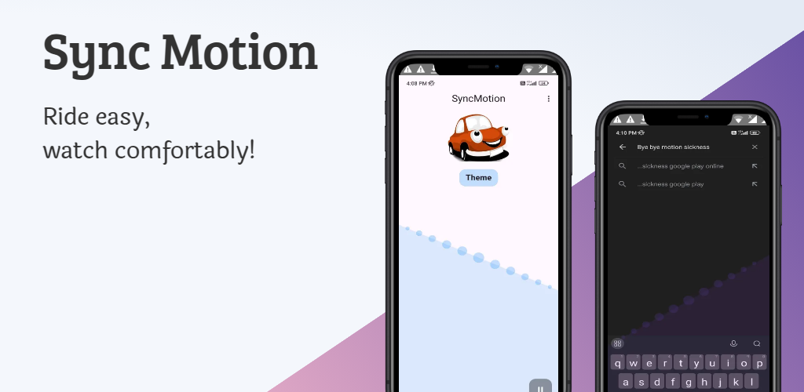

## Sync Motion Application

### Stay steady with a display that moves with you—perfect for car rides! 🚘

  

 

# 📲 Features:

- Motion-synced display for a smooth experience 🎯
- Helps reduce motion sickness in moving vehicles
- Customizable shapes and colors 🎨⚙️
- Ideal for watching content in cars, buses, and trains 🚀

Stay balanced with Sync Motion! 💫📲✨

# 📦 Dependencies

- [get](https://pub.dev/documentation/get/latest/)
- [flutter_overlay_window](https://pub.dev/packages/flutter_overlay_window)
- [sensors_plus](https://pub.dev/packages/sensors_plus)
- [get_storage](https://pub.dev/documentation/get_storage/latest/)

# 🔗 Connect with me

 

# 🤝 Contribution

Contributions are welcome! If you have suggestions, improvements, or bug fixes, please open an issue
or submit a pull request.

1. Fork the repository.
2. Create a new branch (feature-branch)
3. Commit your changes.
4. Push to the branch and submit a pull request.

# 📬 Contact

For issues or suggestions, open an issue or reach out at avniprajapati21101@gamil.com.
